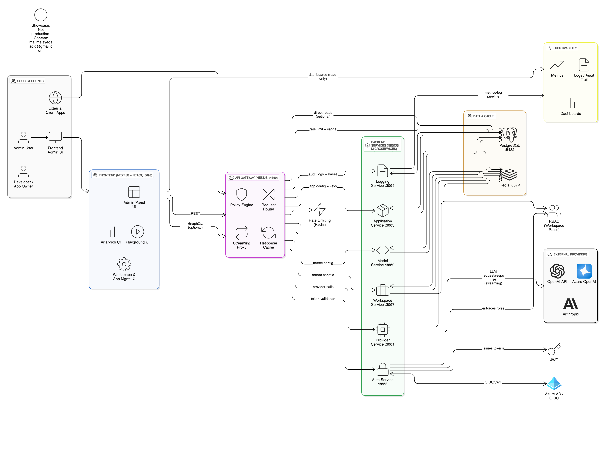
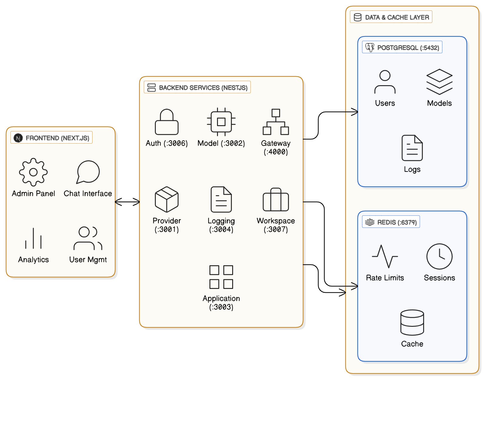
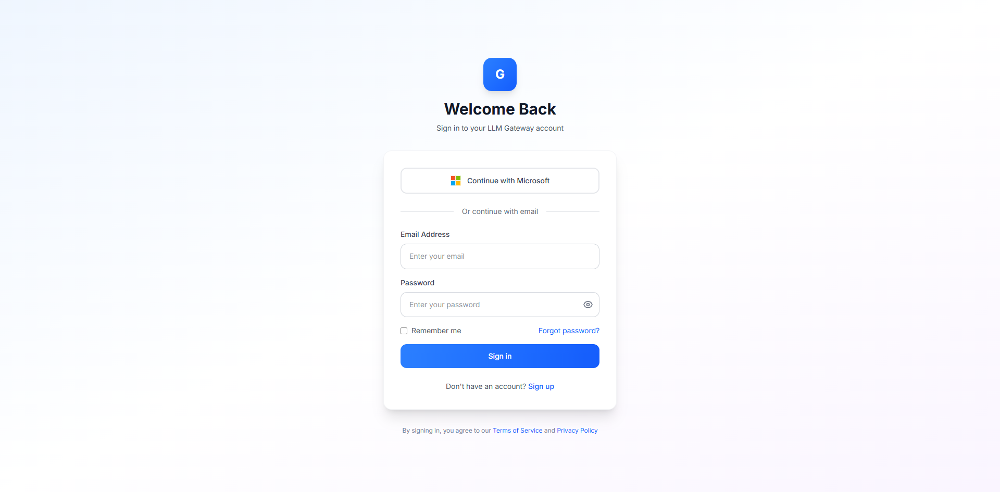
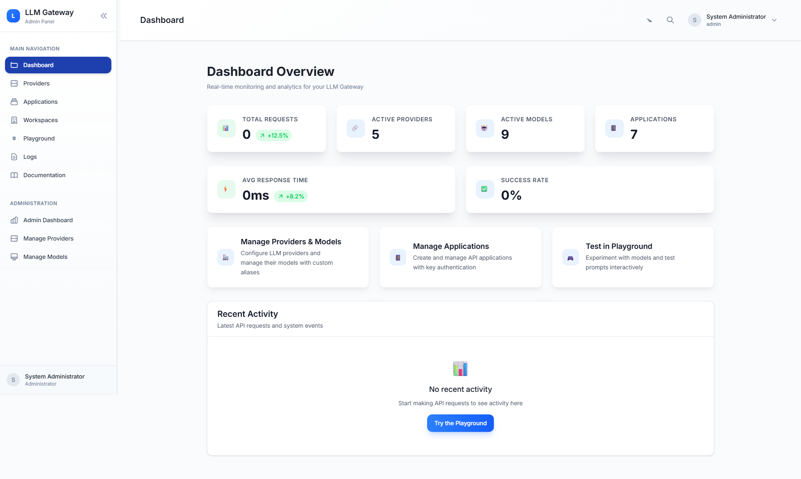
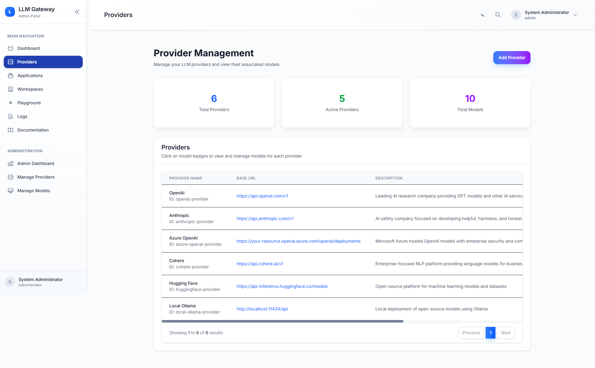
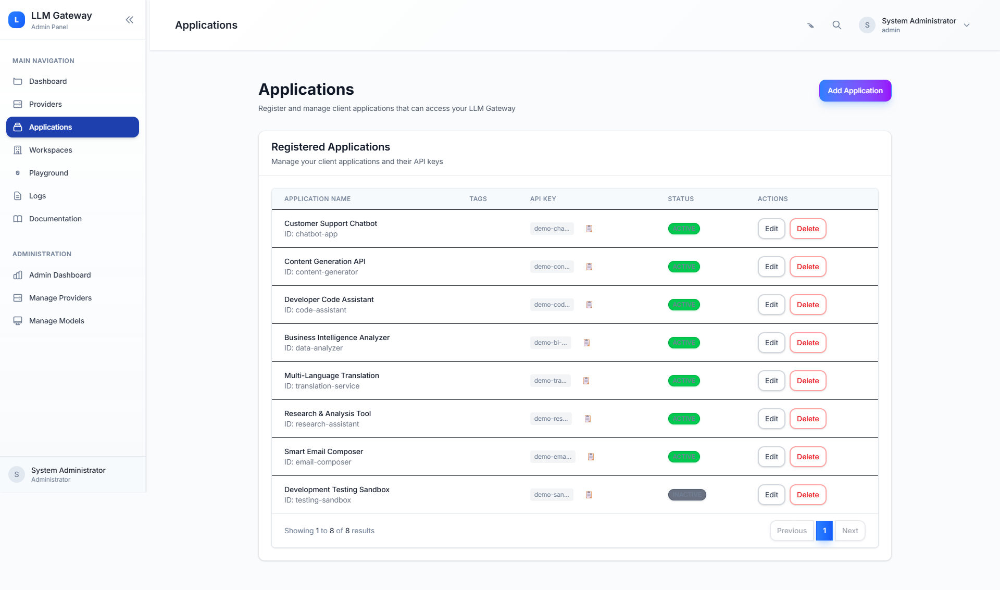
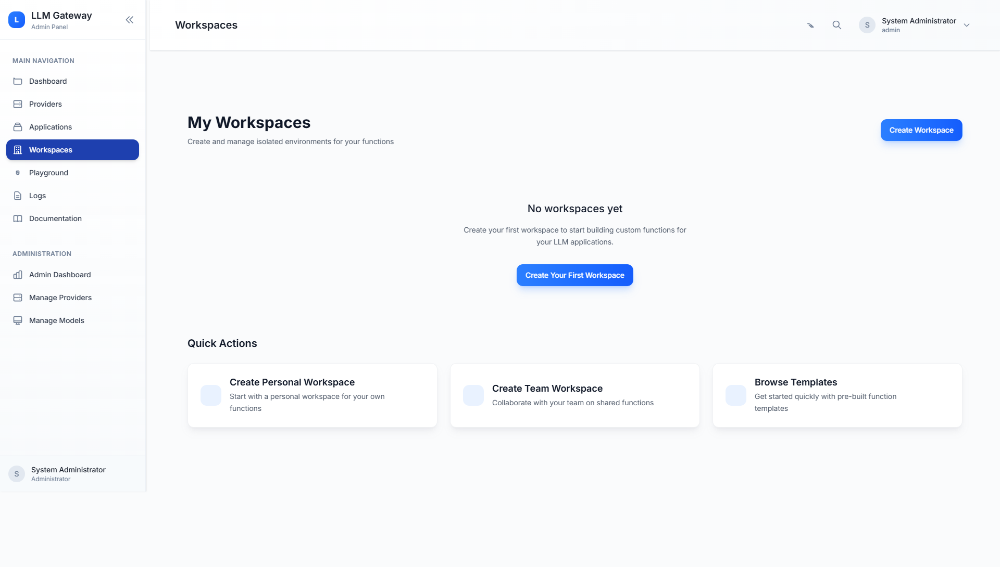

# 🚀 LLM Gateway - Enterprise AI Infrastructure

> Enterprise LLM gateway designed to manage multi-provider AI usage with centralized governance, observability, and tenant isolation.

## ⚠️ **SHOWCASE REPOSITORY**
**This repository contains architecture diagrams, screenshots, and illustrative service structure examples demonstrating the design and capabilities of a proprietary enterprise LLM gateway system. The actual production codebase contains proprietary business logic and is not publicly available.**

**For inquiries about the full system or collaboration opportunities:**
- 💼 **LinkedIn**: [Syed Sadiq](https://www.linkedin.com/in/syed-sadiq-0952ab8a/)

## 📋 The Challenge & Solution

**The Problem**: Organizations struggle with AI infrastructure complexity - multiple providers, security concerns, cost management, compliance requirements, and scaling challenges.

**My Solution**: A unified enterprise gateway that abstracts away the complexity while providing the control and visibility that enterprises demand. Think of it as the "single pane of glass" for all your organization's AI interactions.

## Core Capabilities

### Multi-Provider Routing
Unified interface across OpenAI, Anthropic, and Azure OpenAI with intelligent failover and load balancing.

### Tenant Isolation & RBAC
Multi-workspace architecture with granular permissions and resource quotas per team.

### Cost & Usage Governance
Request tracking, budget controls, and usage analytics with configurable rate limiting.

### Observability & Auditability
Comprehensive logging, metrics collection, and audit trails for compliance requirements.

### Interactive Testing Surface
Built-in playground for prompt engineering and model experimentation before production deployment.

### Enterprise Authentication
Azure AD integration with JWT token management and session handling.

## Performance Design Goals

- **Latency Target**: Sub-3 second P95 response times
- **Concurrency**: Architected to handle 1000+ concurrent requests
- **Availability**: High availability through horizontal scaling and service redundancy
- **Caching Strategy**: Multi-layer caching for cost optimization and performance

## 🏛️ System Architecture

*Comprehensive system architecture showing microservices, data flow, and external integrations*

### System Components

*The three-tier architecture that keeps everything organized: Frontend for users, Backend services for logic, Data layer for persistence*

## Technology Stack

### Frontend
- **Next.js 15** - React framework with App Router
- **React 19** - Component library with concurrent features
- **TypeScript** - Type safety and developer experience
- **Tailwind CSS** - Utility-first CSS framework

### Backend
- **NestJS** - Node.js framework with dependency injection
- **GraphQL** - API layer with Apollo Server
- **TypeScript** - End-to-end type safety
- **TypeORM** - Database ORM with migration support
- **Passport.js** - Authentication middleware

### Infrastructure
- **PostgreSQL** - Primary data store
- **Redis** - Caching and session management
- **Docker** - Containerization and deployment
- **Azure AD** - Enterprise identity provider

## Application Screenshots

### Enterprise Authentication

*Azure AD integration with enterprise SSO capabilities*

### Admin Dashboard

*System monitoring with real-time metrics and performance analytics*

### Provider Management

*Multi-provider configuration and health monitoring interface*

### Applications Management

*Application lifecycle management with deployment and configuration controls*

### Workspace Management

*Multi-tenant workspace organization with role-based access control*

### Interactive Playground

*Built-in testing environment for model experimentation and prompt engineering*

## 🎯 **About This Showcase**

This repository contains **architecture diagrams, screenshots, and illustrative service structure examples** demonstrating the design and capabilities of a proprietary enterprise LLM gateway system.

**This is not a deployable application** - it's a professional showcase of:
- ✅ System architecture and design patterns
- ✅ User interface and user experience design  
- ✅ Code structure and development practices
- ✅ Enterprise-grade feature capabilities

**For technical discussions about the actual implementation:**
- 💼 **LinkedIn**: [Syed Sadiq](https://www.linkedin.com/in/syed-sadiq-0952ab8a/)

## What You'll Find Here

- **Architecture Diagrams** - System design and component relationships
- **Application Screenshots** - UI implementation and feature demonstration  
- **Illustrative Service Structure Examples** - Service structure illustrations (non-production)
- **Technical Documentation** - System design decisions and trade-offs

## Documentation

- [Deployment Guide](docs/DEPLOYMENT.md) - Complete setup and deployment instructions
- [Architecture Details](docs/architecture.md) - In-depth system architecture explanation

## Author

**Syed Sadiq** - Enterprise AI Infrastructure Architect

💼 **LinkedIn**: [https://www.linkedin.com/in/syed-sadiq-0952ab8a/](https://www.linkedin.com/in/syed-sadiq-0952ab8a/)

---

⭐ **Star this repository if you found it helpful!**
